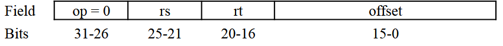
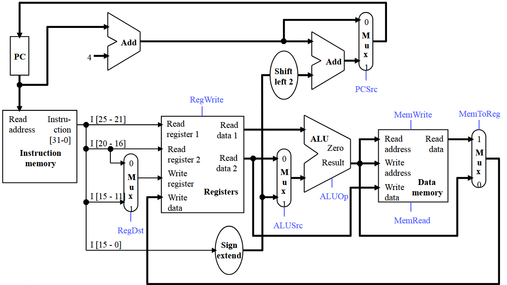

**1)** Discuss different types of addressing in MIPS ISA, show example of instruction use it

<div class="answer-area" style="--lines:10;"></div>

---

**2)**  

Intel 8085 is a little endian microprocessor. what is the correct memory state after perform the following operation. copy the bytes 0xBBFF2211 to memory (Assume start memory address is 10000F)

<table class="tutorial-table">
<tr>
    <th>Address</th>
    <th>Content</th>
</tr>
<tr>
    <td>10000F</td>
    <td></td>
</tr>
<tr>
    <td></td>
    <td></td>
</tr>
<tr>
    <td></td>
    <td></td>
</tr>
<tr>
    <td></td>
    <td></td>
</tr>
</table>

--- 

**3)**  

Determine the following computer hardwire parameters to be designed:  

1. Total number of instructions that can be implemented in the processor for (all types R, LS type and J)
2. Size of the register file (number of registers)
3. Maximum size of main memory (assume that a program can access data from any place in it)
4. How many bits are needed for the program counter (PC) and the instruction register (IR)

<div class="answer-area" style="--lines:15;"></div>

---

**4)**  Show how in MIPS assembly to copy immediate value 0xFFFF7643 into register $s0

<div class="answer-area" style="--lines:4;"></div>

---

**5)** Translate this code into MIPS:
```C
int sum = 0;

for(int i = 0; i < n; ++i)
    sum += A[i];
```

<div class="answer-area" style="--lines:8;"></div>

---

**6)** Assume that the variables f, g, h, i, and j are assigned to registers $s0, $s1, $s2, $s3, and $s4, respectively. Assume that the base address of the arrays A and B are in registers $s6 and $s7, respectively.

```C
f = g - A[B[4]];
```

a. For the C statement above, what is the corresponding MIPS assembly code?

<div class="answer-area" style="--lines:6;"></div>

b. For the C statement above, how many MIPS assembly instructions are needed?

<div class="answer-area" style="--lines:2;"></div>

c. For the C statement above, how many different registers are needed?
<div class="answer-area" style="--lines:2;"></div>

---

**7)** Assume that the variables f, g, h, i, and j are assigned to registers $s0, $s1, $s2, $s3, and $s4, respectively. Assume that the base address of the arrays A and B are in registers $s6 and $s7, respectively.

```asm
lw $s0, 4($s6)
```

a. For the MIPS assembly instructions above, what is the corresponding C statement?
<div class="answer-area" style="--lines:4;"></div>

b. For the MIPS assembly instructions above, rewrite the assembly code to minimize the number of MIPS instructions (if possible) needed to carry out the same function.

<div class="answer-area" style="--lines:2;"></div>

c. How many registers are needed to carry out the MIPS assembly as written above? If you could rewrite the code above, what is the minimal number of registers needed?

<div class="answer-area" style="--lines:2;"></div>

---

**8)**  
a. Implement the “branch if memory and register are equal” (bmre) instruction, which uses the i-type



The bmre instruction has the following semantics:
```C
if (R[rt] == M[R[rs]]) {
                    // PC = PC + 4 + 4*offset;
} else {
                    // PC = PC + 4
}
```

Show what changes are needed to support bmre instruction and write (next to the signal’s name) values of all
control signals for this instruction. You should only add wires, muxes, and a comparator (as shown above) to the
datapath; do not modify the main functional units themselves (the memory, register file and ALU). Try to keep
your diagram neat!


