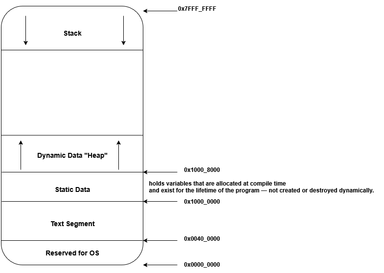
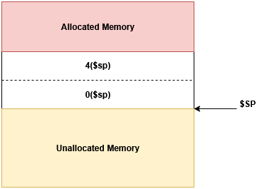

# CSE301 – Computer Organization  
## Lab 3: Memory Layout - Functions

---

### Memory Layout in MIPS

* Text Segment → where instructions live (code section).
* Static Data Segment → contains .data and .bss:
    * .data → initialized variables (x: .word 5)
* Heap → for dynamically allocated memory (malloc, etc.).
* Stack → used for function calls, local variables, and saved registers.
    * Stack grows down (toward lower addresses).

<br>

<div style="text-align:center">
  <br>
  <em>Figure 1: Memory Layout</em>
</div>

---

### Accessing Memory: Load and Store Instructions

#### Load instructions

| Instruction | Meaning | Example |
|---|---|---|
| `lb` | Load Byte (8 bits) | `lb $t0, 0($a0)` |
| `lh` | Load Halfword (16 bits) | `lh $t0, 2($a1)` |
| `lw` | Load Word (32 bits) | `lw $t0, 0($sp)` |

### Store instructions

| Instruction | Meaning        | Example          |
| ----------- | -------------- | ---------------- |
| `sb`        | Store Byte     | `sb $t2, 0($a0)` |
| `sh`        | Store Halfword | `sh $t3, 2($a1)` |
| `sw`        | Store Word     | `sw $t1, 0($sp)` |

---
### The Static/Data Segment

Used to store global, static, constants values or any data you write in compile time  

```asm
.data

var1: .word 7
var2: .word 15
var3: .word 8

str1: .asciiz "hello world"
```

---

### The Stack Segment

Used to store function data  
* Save `$ra` (return address)
* Save any registers it modifies (`$s` registers)
* Allocate space for local variables

To allocate stack:

```asm
addi $sp, $sp, -8            # allocate two words
```
<br>

<div style="text-align:center">
  <br>
  <em>Figure 2: Allocate Stack</em>
</div>

To deallocate stack:

```asm
addi $sp, $sp, 8            
```

**Exercise**  
Trace what is inside each register in the code while executing this program:  

*initially*  
$t0 = 7, $s0 = 15, $s1 = 8

```asm
    addi    $sp, $sp, -8

    sw      $s0, 0($sp)
    sw      $s1, 4($sp)
    lw      $t1, 0($sp)

    add     $t2, $t0, $t1
    addi    $sp, $sp, -4

    sw      $t2, 0($sp)

    add     $s0, $t1, $t2
    sub     $s1, $t2, $s1

    sw      $s1, 4($sp)

    addi    $sp, $sp, 12
```

**Execution Table**  

| Step | Instruction          | `$sp` | `$t0` | `$t1` | `$t2` | `$s0` | `$s1` | Stack (from low → high) |
| ---- | -------------------- | ----- | ----- | ----- | ----- | ----- | ----- | ----------------------- |
| Init | —                    | 1000  | 7     | —     | —     | 15    | 8     | —                       |
| 1    | `addi $sp, $sp, -8`  | 992   | 7     | —     | —     | 15    | 8     | allocate 2 words        |
| 2    | `sw $s0, 0($sp)`     | 992   | 7     | —     | —     | 15    | 8     | [992]=15                |
| 3    | `sw $s1, 4($sp)`     | 992   | 7     | —     | —     | 15    | 8     | [996]=8                 |
| 4    | `lw $t1, 0($sp)`     | 992   | 7     | 15    | —     | 15    | 8     | —                       |
| 5    | `add $t2, $t0, $t1`  | 992   | 7     | 15    | 22    | 15    | 8     | —                       |
| 6    | `addi $sp, $sp, -4`  | 988   | 7     | 15    | 22    | 15    | 8     | allocate 1 words        |
| 7    | `sw $t2, 0($sp)`     | 988   | 7     | 15    | 22    | 15    | 8     | [988]=22                |
| 8    | `add $s0, $t1, $t2`  | 988   | 7     | 15    | 22    | 37    | 8     | —                       |
| 9    | `sub $s1, $t2, $s1`  | 988   | 7     | 15    | 22    | 37    | 14    | —                       |
| 10   | `sw $s1, 4($sp)`     | 988   | 7     | 15    | 22    | 37    | 14    | [992]=14                |
| 11   | `addi $sp, $sp, 12`  | 1000  | 7     | 15    | 22    | 37    | 14    | stack restored          |

---

### Functions

#### Function Call

1. Caller Save registers if needed
2. arguments are passed over $a0 - $a3 or Stack
3. `jal  <function label>`
   * PC  ← address of function
   * $ra ← address to return after return from function
4. Callee execute
5. return values are placed in $v0 - $v1 or Stack or ...


#### Function Create

```asm
<function-name>:
    addi $sp, $sp, -4
    sw   $ra, 0($sp)

    # function body
    # code to execute

    lw   $ra, 0($sp)
    addi $sp, $sp, 4

    jr $ra
```


#### Caller Save vs. Callee Save Convention


**The Problem**  

When one function calls another, both functions use registers.  
If both just freely overwrite registers, values will be lost — so MIPS defines rules for who is responsible for saving which registers.

| Term | Meaning   |
|---|---|
| **Caller-save** | The **calling function** must save a register *before calling* another function if it wants to preserve its value. |
| **Callee-save** | The **called function** must save and restore a register if it changes it.|

<br>

|    Register   |         Name        |         Saved by         |                  Purpose                 |
| :-----------: | :-----------------: | :----------------------: | :--------------------------------------: |
|   `$a0–$a3`   |  Argument registers |          Caller          |            Function arguments            |
|   `$v0–$v1`   |   Value registers   |          Caller          |               Return values              |
|   `$t0–$t9`   | Temporary registers |      **Caller-save**     |  Temporaries; caller must save if needed |
|     `$ra`     |    Return address   | Caller (in nested calls) |              Return location             |
|   `$s0–$s7`   |   Saved registers   |      **Callee-save**     | Must be restored by callee before return |
|     `$sp`     |    Stack pointer    |          Callee          |     Must be restored before returning    |
| `$fp` / `$s8` |    Frame pointer    |          Callee          |        If used, must be preserved        |


<div class="lab">
  <h4>Lab Exercise 1: Add two numbers</h4>

  <p>
    Write a MIPS assembly program that creates a function that add two numbers
  </p>
</div>

<div class="lab">
  <h4>Lab Exercise 2: Factorial</h4>

  <p>
    Write a MIPS assembly program that creates a function that return the factorial of a number n
  </p>
</div>


<div class="lab">
  <h4>Lab Exercise 3: Recursive Factorial</h4>

  <p>
    Edit the previous code to make the function recursive.
  </p>
</div>


<div class="task">
  <strong>Task:</strong>
  <br><br>

  <strong>Task 1:</strong> Write a MIPS assembly program that creates a function to calculate fibonacci for a number entered by the user
  <br/>
  
  <strong>Task 2:</strong> Edit the previous code to make the function recursive.
  <br/>

  <strong>Task 3:</strong> Complete the given MIPS program to correctly save and restore registers according to the MIPS calling convention.
  <br/>

  <strong style="color:#D7263D">Note: You can find any required starter file for these tasks in the starterFiles/ directory.</strong>
  <br>

</div>


