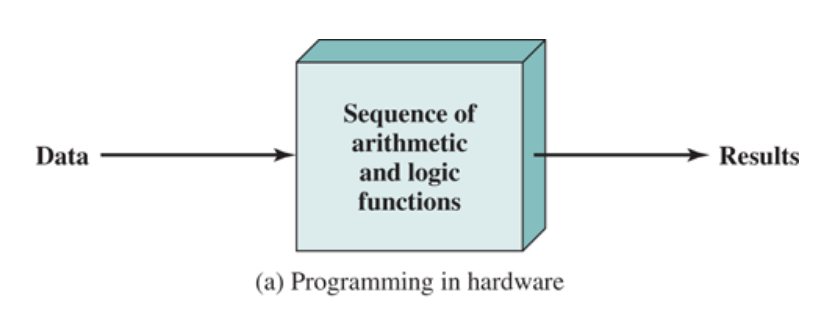
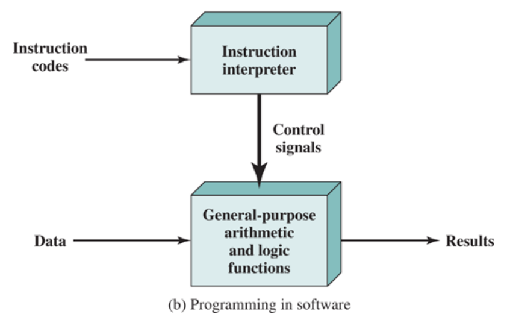
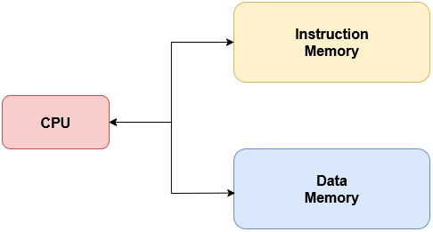
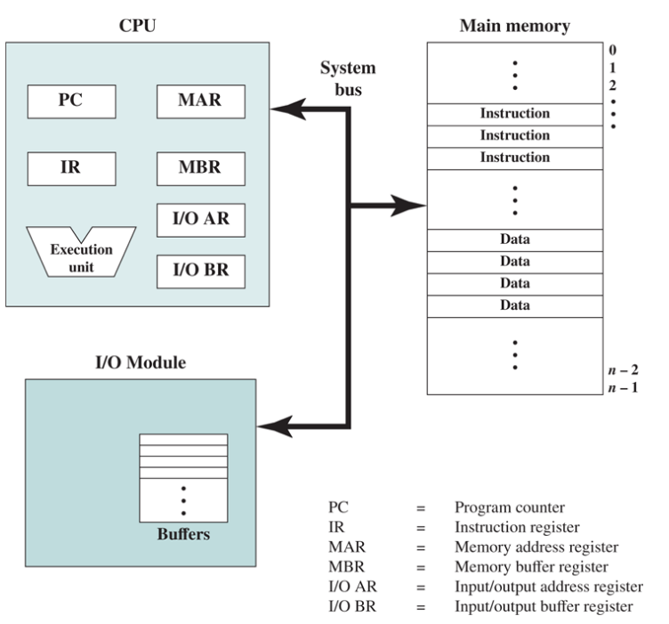

# CSE301 – Computer Organization  
## Lecture 2 Notes

---

### Programming Concept

<table>
  <thead>
    <tr>
      <th></th>
      <th>Special Purpose (Customized) Hardware</th>
      <th>General Purpose Hardware</th>
    </tr>
  </thead>
  <tbody>
    <tr>
      <td><strong>Logic Components Interconnection</strong></td>
      <td>Logic components are connected to perform a specific task.</td>
      <td>Logic components are connected to form general hardware configured using input control signals.</td>
    </tr>
    <tr>
      <td><strong>Types of Computations</strong></td>
      <td>Based on how components are connected (<strong>hardwired programming</strong>).</td>
      <td>Defined by input control signals (<strong>software programming</strong>).</td>
    </tr>
    <tr>
      <td><strong>Change Computation Type</strong></td>
      <td>Replace or rewire the hardware.</td>
      <td>Change the program/code.</td>
    </tr>
    <tr>
      <td><strong>Diagram</strong></td>
      <td>
        
      </td>
      <td>
        
      </td>
    </tr>
  </tbody>
</table>

---

### Common Computer Architectures

There are several computer architectures, but the **most common** and historically significant one is the **Von Neumann Architecture**.

#### 🧩 Von Neumann Architecture
The **Von Neumann Architecture** is based on the idea that both **data** and **instructions** share the **same memory space**.  
It is characterized by the following principles:

1. **Shared Memory:**  
   Both data and instructions are stored in a **single read/write memory**.

2. **Addressable Memory:**  
   Each memory location can be **uniquely addressed**, regardless of the content stored there.

3. **Sequential Execution:**  
   Instructions are executed **one after another**, in a sequential manner — unless the sequence is modified by control instructions (e.g., jumps or branches).

   
  <em>Figure 1: Von Neumann Architecture</em>

#### ⚙️ Harvard Architecture
In contrast, the **Harvard Architecture** uses **separate memory** for data and instructions, allowing simultaneous access and faster performance.

   
  <em>Figure 2: Harvard Architecture</em>

---

### Instruction Cycle

#### Computer Components

   
  <em>Figure 3: Computer Components</em>

#### Instruction Cycle

The **Instruction Cycle** is the fundamental process by which a computer executes instructions.  
It primarily consists of two major stages:

- **Fetch Cycle**
- **Execute Cycle**

#### Fetch Cycle

1. **Program Counter (PC)** holds the address of the next instruction to be fetched.  
2. The **processor fetches** the instruction from memory into the **Memory Data/Buffer Register (MDR / MBR)**.  
3. The **Memory Address Register (MAR)** is loaded with the address from the **PC**.  
4. **PC** is **incremented** to point to the next instruction.  
5. The fetched instruction is **transferred to the Instruction Register (IR)** for decoding.

**Registers updated during fetch:**

- `MAR` ← PC  
- `MBR` ← Memory[MAR]  
- `IR` ← MDR  
- `PC` ← PC + 1 

#### Execute Cycle

The **execute cycle** performs the operation specified by the instruction.  
Depending on the instruction type, it may:
- Access memory  
- Perform arithmetic or logic operations  
- Control program flow (e.g., jumps, branches)  
- Communicate with I/O devices  

For **CPU–Memory** or **CPU–I/O** type instructions, the steps typically include:

1. **Instruction Fetch** – (Already done in the Fetch Cycle)  
   - `IR` holds the current instruction.  

2. **Instruction Decode**  
   - The **Control Unit (CU)** interprets the opcode and identifies the required operands and operation.  

3. **Operand Fetch**  
   - The **MAR or I/O AR** is loaded with the operand address.  
   - The **MBR or I/O BR** receives the operand value from memory or I/O.  
   - If a register operand is required, it’s read from the **register file**.  

4. **Instruction Execute**  
   - The **Arithmetic Logic Unit (ALU)** performs the required operation (add, AND, compare, etc.).  
   - Intermediate results are stored in **Accumulator (ACC)** or a temporary register.  

5. **Operand Store**  
   - The result is written back to memory (`Memory[MAR] ← MDR`) or an output register/I/O port.  

#### Register Updates Summary

| Stage | CPU–Memory Instruction | CPU–I/O Instruction|
|---|---|---|
| Operand Fetch | `MAR` ← address, `MBR` ← Memory[MAR] | `IOAR` ← I/O port, `IODR` ← I/O data |
| Execute | `ACC` ← ALU(MBR or Reg) | `ACC` ← ALU(IOBR or Reg) |
| Operand Store | `MAR` ← address, Memory[MAR] ← MBR | `IOAR` ← port, I/O Write using `IOBR` |
| PC Updates | `PC` ← next instruction (or branch target) | same as memory instruction |

---

###  Machine Instructions Overview

#### Instruction Set
- A **set of all operations** a CPU can perform — known as the **Instruction Set Architecture (ISA)**.  
- Instructions can be represented in:
  - **Binary (machine language)** — executed directly by hardware.
  - **Symbolic (assembly language)** — human-readable mnemonics (e.g., `ADD`, `MOV`).

Each instruction includes:
1. **Opcode** – the operation to perform (e.g., ADD, I/O).  
2. **Source operand(s)** – where data comes from.  
3. **Result operand** – where to store the result.  
4. **Next instruction reference** – usually implicit (from the PC).

Operands can reside in:
- Immediate value  
- Main memory (address)
- CPU register
- I/O device (via I/O module or memory-mapped I/O)

#### Number of Addresses in Instructions

- Each **address** = explicit operand reference.  
- Binary arithmetic operations need:
  - 2 source operands  
  - 1 destination operand  
  - 1 next instruction address (implicit via PC)

So **up to 4 addresses** are needed — but specifying all would make instructions too long!  
Hence, some are **implicit**.

**Address Formats**

| Type | Example | Description |
|------|----------|-------------|
| **3-address** | `C = A + B` | Two operands and one destination; long but flexible. |
| **2-address** | `A = A + B` | One operand doubles as destination; shorter. |
| **1-address** | `AC = AC + X` | Uses an accumulator register implicitly. |
| **0-address** | Stack-based (`push`, `pop`) | Operands are taken from the top of the stack. |

---

### Interrupts

An **interrupt** temporarily halts the normal program flow so the CPU can handle another event (e.g., I/O, timer, or error).  
→ Improves CPU efficiency by avoiding idle waiting.

#### Types of Interrupts
- **Program:** Execution errors (e.g., divide by zero)
- **Timer:** From internal clock (for multitasking)
- **I/O:** From device controllers (data ready)
- **Hardware Failure:** Faults (e.g., memory error)

#### Interrupt Cycle
1. CPU checks for interrupt after each instruction.  
2. If none → fetch next instruction.  
3. If interrupt →  
   - Save context (PC + registers)  
   - Load ISR (Interrupt Service Routine) address  
   - Execute ISR → restore context → resume program  

#### Multiple Interrupts

| **Method**  | **Description** |
| --- | --- |
| **Sequential Execution** | Interrupts are handled one at a time in the order they arrive (like a queue). The current ISR must finish before another begins — always **non-preemptive**. |
| **Priority Execution**   | Interrupts are handled based on their priority level (using a priority queue). A higher-priority interrupt may either:  – **Disable the interrupt line** → acts **non-preemptively**.  – **Leave the line enabled** → allows **preemption (nested interrupts)**. |

