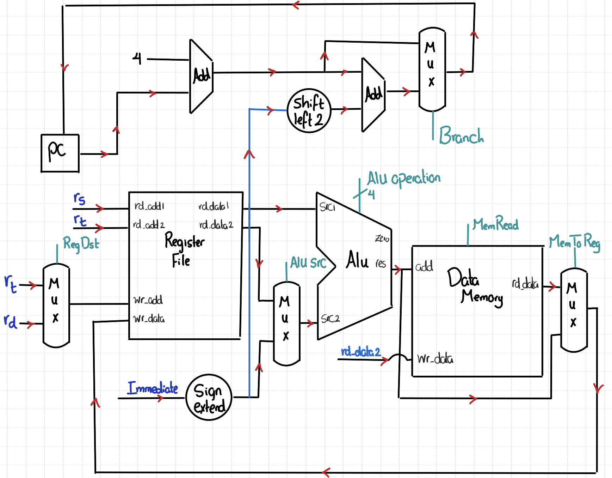
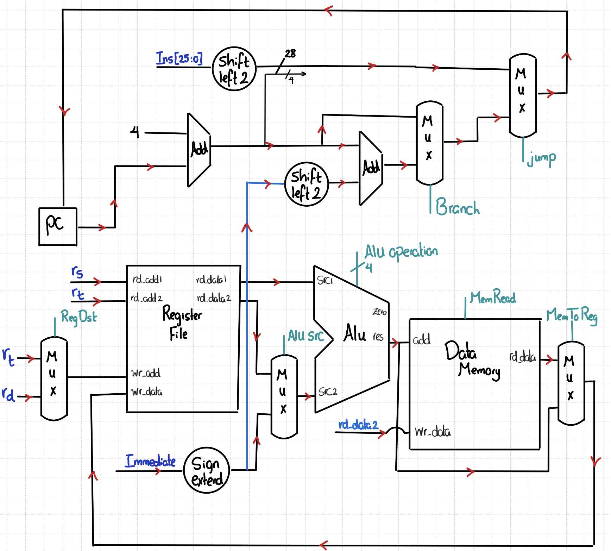
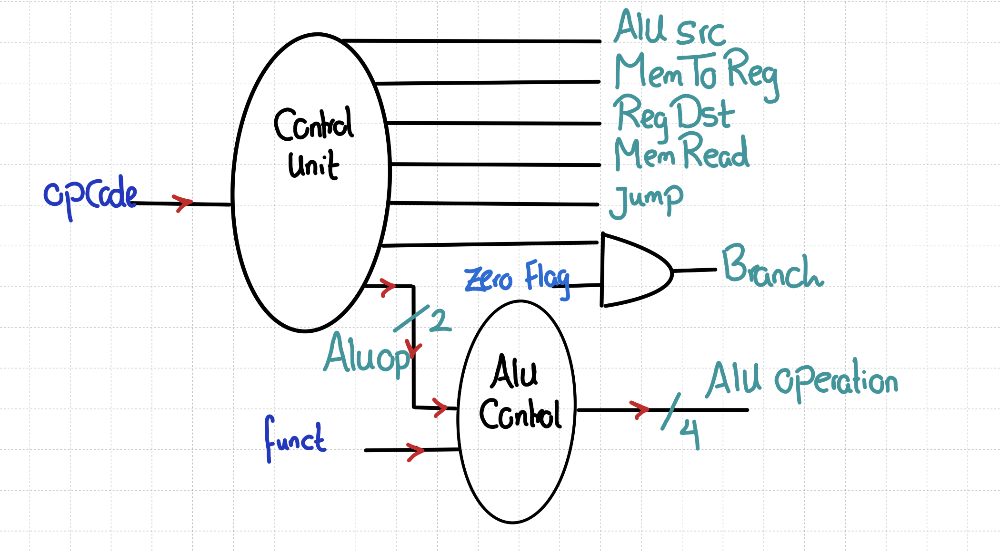

# CSE301 – Computer Organization
## Lecture 4 – Single-Cycle Processor

---

###  Instruction Stages

Each instruction passes through the following stages:


###  Single-Cycle Processor

* Executes **each instruction in one clock cycle**.
* The **clock period** must be long enough to accommodate the **slowest instruction**.
* **Drawback:** Overall performance is limited by the slowest instruction.


### Building the Datapath

#### 1. Instruction Fetch


#### 2. Adding R-Type Instructions


#### 3. Adding I-Type Instructions (ALU Operations)


#### 4. Adding I-Type Instructions (Load & Store)


#### 5. Adding I-Type Instructions (Branch)



#### 6. Adding J-Type Instructions




### Control Unit




### Performance Considerations

* The **clock period** is determined by the **longest instruction delay**.
* The **critical path** typically occurs in **load instructions**:

  ```
  Instruction memory → Register file → ALU → Data memory → Register file
  ```
* It’s **impractical** to change the clock period per instruction.
* Violates the design principle:

  > “Make the common case fast.”
