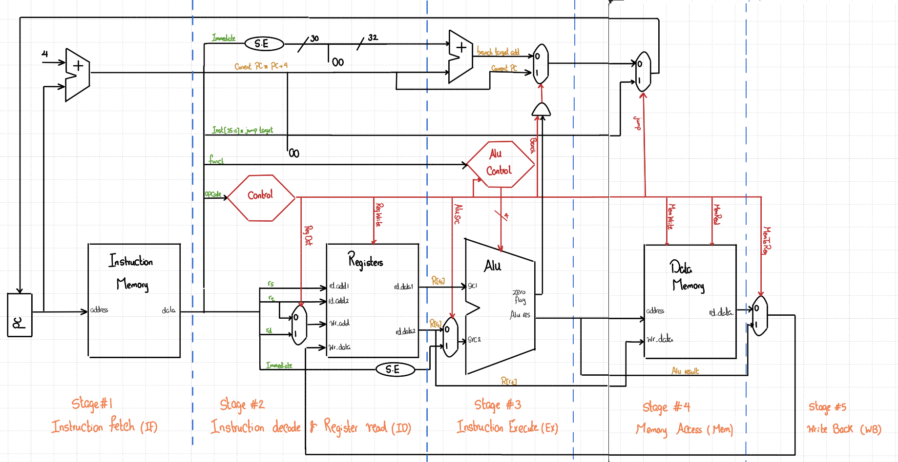
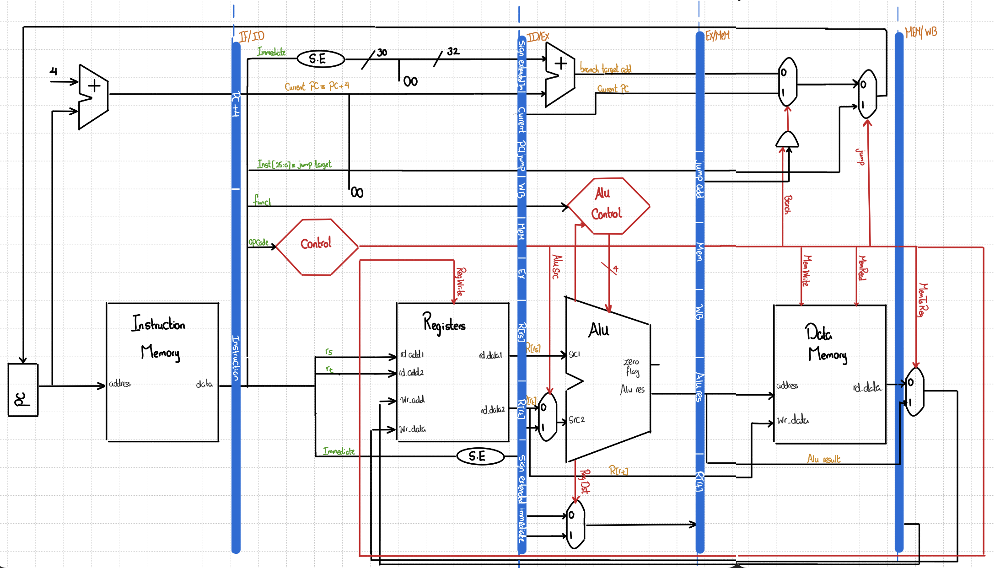
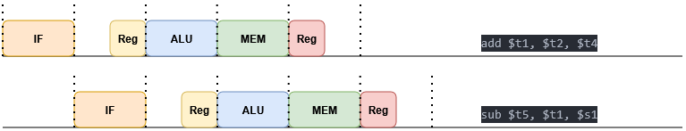
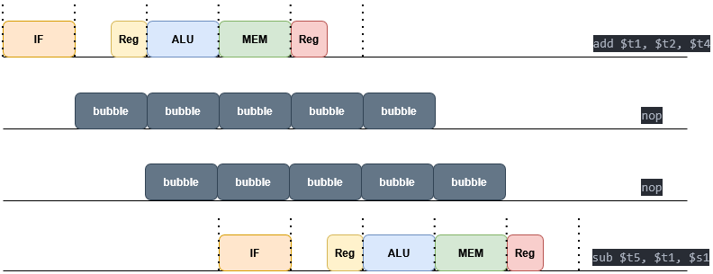
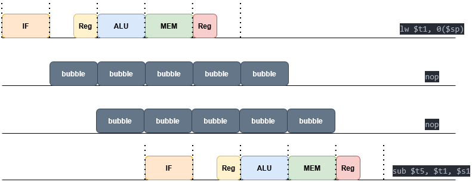
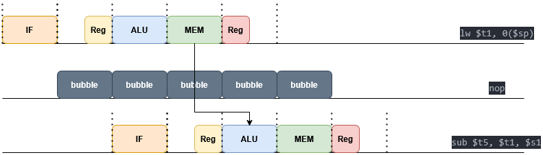
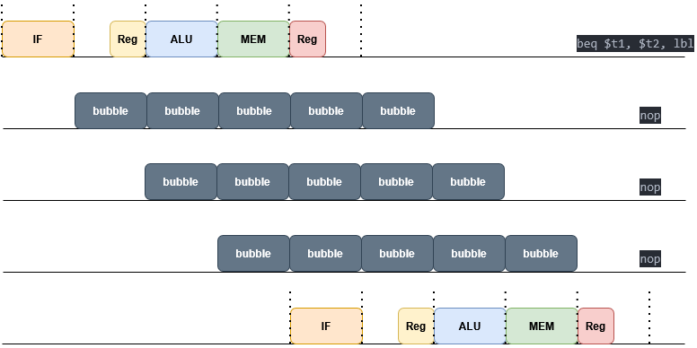
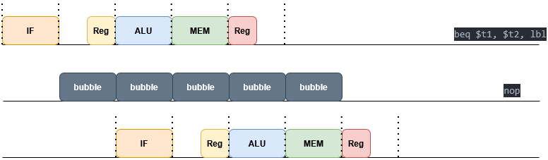
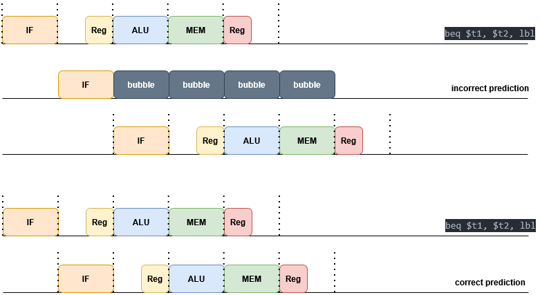
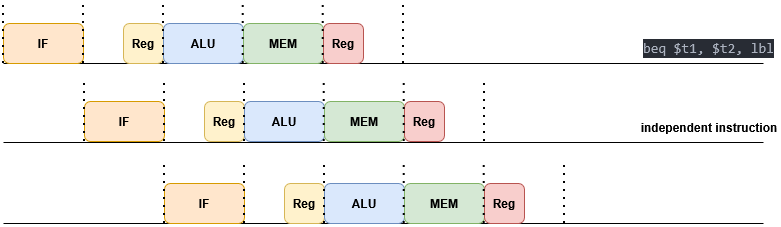

# CSE301 – Computer Organization
## Lecture 5 – Pipeline Processor

---

### Converting between single cycle processor to pipeline

The Single-Cycle Processor executes an entire instruction within one clock cycle. The major limitation of this design is that the duration of the clock cycle is dictated by the longest-running instruction, causing simpler instructions to waste time and resulting in low overall throughput.

<div style="text-align:center">
  <br>
  <em>Figure 1: Single Cycle Processor</em>
</div>

<br>

The Pipelined Processor uses the same basic functional units as the single-cycle design, but achieves massive performance gains by dividing the instruction process into discrete stages (e.g., IF, ID, EX, MEM, WB).

The critical component introduced for this transformation is the **Interstage Register** (also known as a Pipeline Register). These registers are placed between each stage to hold the results of the preceding stage until the next clock cycle.


<div style="text-align:center">
  <br>
  <em>Figure 2: Pipeline Processor</em>
</div>

<br>

<div style="text-align:center">
  <br>
  <em>Figure 3: Pipeline Instructions execution</em>
</div>


### Cycle time, latency and throughput

**Non pipelined processor**  

cycle time = T<sub>IF</sub> + T<sub>ID</sub> + T<sub>EX</sub> + T<sub>MEM</sub> + T<sub>WB</sub>

latency = cycle time

Throughput(IPS) = 1/CT

**Pipelined processor**

cycle time = max(T<sub>IF</sub>, T<sub>ID</sub>, T<sub>EX</sub>, T<sub>MEM</sub>, T<sub>WB</sub>) + T<sub>inter stage reg</sub>

latency = CT x no. of stages

Throughput = IPS


> [!NOTE]
> It is prefered to make stages balanced "time for each stage is almost the same" to make the pipeline effiecient.

### Pipelined hazards

**[1] Structural Hazard** resouce contention, using the same resource by two different instructions at the same time 

MIPS doesn't have such a problem, How it possible?

<div style="text-align:center">
  <br>
</div>

<br>

**[2] Data hazards** data dependencies between instructions.

i. WAR: Write After Read

```asm
add $t1, $t2, $t3
sub $t2, $s0, $s1
```

<div style="text-align:center">
  <br>
</div>

<br>

ii. WAW: Write After Write

```asm
add $t1, $t2, $t3
sub $t1, $s0, $s1
```

<div style="text-align:center">
  <br>
</div>

<br>

iii. RAR : Read After Read

```asm
add $t1, $t2, $t4
sub $t3, $t2, $s1
```

<div style="text-align:center">
  <br>
</div>

<br>

iv. RAW : Read After Write

```asm
add $t1, $t2, $t4
sub $t5, $t1, $s1
```

<div style="text-align:center">
  <br>
</div>

<br>

RAW is the only one that has a problem of data dependency in MIPS

Solutions:

1. Add stall or nop instructions
   
*Arithmetic instructions*  

<div style="text-align:center">
  <br>
</div>


*Load instruction*  
<div style="text-align:center">
  <br>
</div>

2. Forwarding

*Arithmetic instructions*  

<div style="text-align:center">
  <br>
</div>


*Load instruction*  
<div style="text-align:center">
  <br>
</div>

3. Code scheduling: a good compiler can add instructions in place of nop instruction that is have no dependnecies


**[3] Control hazards** Branching instructions

We are not sure that branch is taken or not until stage #4 "After Excute instruction and get the flag

Solutions:  
1. Add 3 nops

<div style="text-align:center">
  <br>
</div>

2. Move branch hardware to stage #2 & add one nop

<div style="text-align:center">
  <br>
</div>

3. Move branch hardware to stage #2 & use speculation "branch prediction"

<div style="text-align:center">
  <br>
</div>
   
4. Delayed branch "most commonly used method"

<div style="text-align:center">
  <br>
</div>