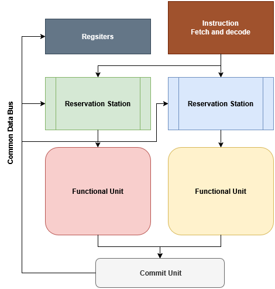

# CSE301 – Computer Organization
## Lecture 5 – Instruction-Level Parallelism (ILP)

---

**Instruction-Level Parallelism (ILP)** refers to the ability of a processor to **execute multiple instructions concurrently** by exploiting parallelism within a single program.
The idea is to overlap or run independent instructions at the same time to increase performance.

There are **two main types** of ILP:


### **1. Static ILP (Compiler-Controlled ILP)**

In static ILP, instruction parallelism is extracted **at compile time**.
The compiler analyzes the program, detects independent instructions, and schedules them to execute in parallel.

Characteristics:

* The compiler determines which instructions can issue together in the same cycle.
* Parallelism is fixed before runtime.
* Very dependent on compiler quality.

#### **Static ILP Architectures**

1. **SISD (Single Instruction, Single Data)**
   Traditional sequential computers.

2. **SIMD (Single Instruction, Multiple Data)**
   One instruction operates on many data elements simultaneously.
   Common in GPUs and vector processors.

3. **MIMD (Multiple Instruction, Multiple Data)**
   Multiple processors execute different instructions on different data streams.

4. **MISD (Multiple Instruction, Single Data)**
   Rare; instructions operate in parallel on the same data.

#### **VLIW (Very Long Instruction Word)**

A key form of static ILP.

* The compiler packs multiple independent operations into a single long instruction.
* Each part of the instruction is executed by a different functional unit in the same clock cycle.
* No dynamic scheduling hardware → simpler CPU but complex compiler.

> **Note:** In static ILP, the compiler is responsible for ensuring that issued instructions have **no data dependencies**.

---

### **2. Dynamic ILP (Hardware-Controlled ILP)**

In dynamic ILP, the processor extracts parallelism **during runtime**.
The CPU itself decides:

* How many instructions to fetch per cycle
* How many to issue and execute in parallel
* How many results to write back (commit) per cycle

This leads to **superscalar processors**, which fetch and issue **multiple instructions every cycle**.

Dynamic ILP depends heavily on **Tomasulo’s Algorithm**, used for:

* Out-of-order execution
* Detecting dependencies at runtime
* Avoiding stalls
* Register renaming

#### **Superscalar Execution**

A superscalar processor uses wide instruction pipelines that allow:

* Fetching multiple instructions per cycle
* Dispatching them to different functional units
* Executing them out of order
* Committing results in order

The number of instructions fetched/issued per cycle defines the CPU’s **issue width**.

---

### **Tomasulo’s Algorithm (Dynamic Scheduling)**

Tomasulo’s algorithm enables **out-of-order execution** while preserving correct program behavior.

Key ideas:

1. **Instructions share a common fetch/decode/commit pipeline**, done in-order.

2. **Instructions are issued to functional units out-of-order**, based on:

   * The type of operation
   * Availability of operands
   * Availability of the functional unit

3. **Reservation stations** hold instructions until they are ready to execute.

4. **Common Data Bus (CDB)** broadcasts results so waiting instructions can receive operands immediately without reading the register file.

This eliminates many RAW hazards and significantly increases ILP.

<div style="text-align:center">
  <br>
  <em>Figure 1: Superscaler processor</em>
</div>

---

### **Register Renaming**

A critical part of Tomasulo’s algorithm.

#### Why register renaming?

To eliminate **false dependencies**:

* **WAR (Write After Read)**
* **WAW (Write After Write)**

These dependencies occur because multiple instructions use the same architectural registers.

#### How renaming works

* Each architectural register (e.g., `$t0`) is mapped to a **physical register**.
* New instructions get **new physical registers** for their destination operands.
* This prevents later instructions from overwriting a register before earlier instructions read it.

#### Example

Without renaming:

```
add r1, r2, r3   ; writes to r1
sub r1, r4, r5   ; also writes to r1 → WAW
```

With renaming:

```
add → P7
sub → P9
```

Even though both target “r1”, they map to different *physical* registers → no conflict.

This allows:

* Out-of-order execution
* Parallel execution of independent instructions
* Elimination of false hazards (WAR, WAW)


Here is a polished, clean, and lecture-ready section you can add under the **Instruction-Level Parallelism (ILP)** topic.

---

### **Loop Unrolling**

**Loop Unrolling** is a compiler optimization technique used to **increase instruction-level parallelism (ILP)** by reducing loop control overhead and exposing more independent operations to the processor.

The main idea is to **duplicate the loop body multiple times** and reduce the number of iterations.
This creates more straight-line (non-branch) code, allowing the processor—especially superscalar or pipelined CPUs—to execute more instructions in parallel.

---

#### **Why Loop Unrolling Improves Performance**

1. **Reduces branch penalty**
   Fewer branch instructions → fewer control hazards.

2. **Increases ILP**
   More instructions become visible to:

   * the compiler (in static ILP)
   * or the hardware scheduler (in dynamic ILP)

3. **More opportunities for:**

   * instruction scheduling
   * register renaming
   * forwarding and pipelining
   * hiding latency (e.g., load latencies)

---

#### **Basic Example**

Original loop:

```c
for (i = 0; i < 4; i++) {
    a[i] = a[i] + 1;
}
```

Unrolled by a factor of 4:

```c
    a[0] = a[0] + 1;
    a[1] = a[1] + 1;
    a[2] = a[2] + 1;
    a[3] = a[3] + 1;
```

Benefits:

* Branch executes once instead of four times
* Independent instructions → can issue in parallel
* Better utilization of functional units

---

#### **MIPS Example**

Original:

```asm
Loop:
    lw   $t0, 0($s1)
    addi $t0, $t0, 1
    sw   $t0, 0($s1)
    addi $s1, $s1, 4
    addi $s2, $s2, -1
    bne  $s2, $zero, Loop
```

Unrolled by **2**:

```asm
Loop:
    lw   $t0, 0($s1)
    addi $t0, $t0, 1
    sw   $t0, 0($s1)

    lw   $t1, 4($s1)
    addi $t1, $t1, 1
    sw   $t1, 4($s1)

    addi $s1, $s1, 8
    addi $s2, $s2, -2
    bne  $s2, $zero, Loop
```

Now the branch runs only half as often, and the CPU can attempt to overlap the two independent iterations.

