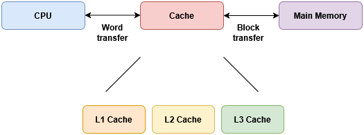
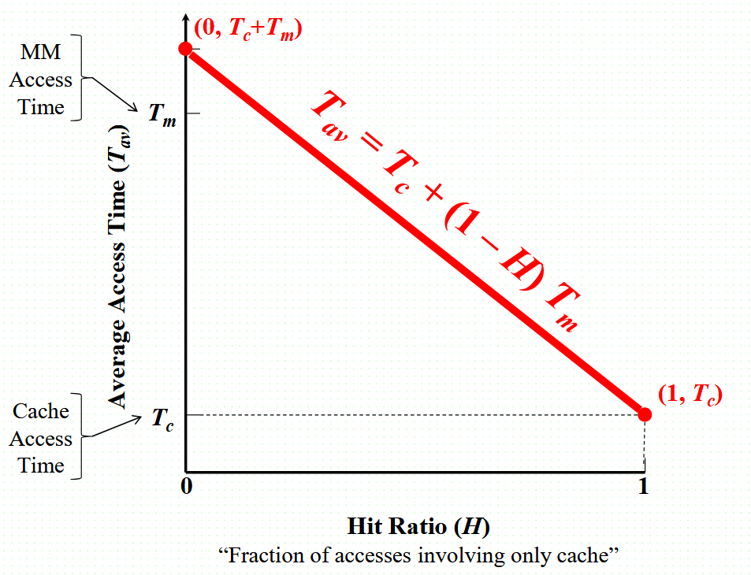
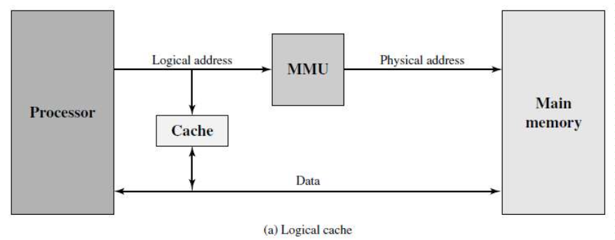
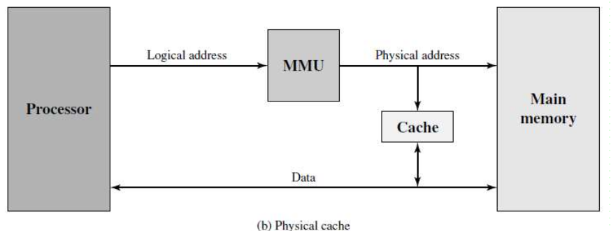
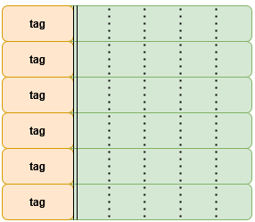
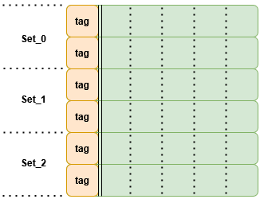

# CSE301 – Computer Organization
## Lecture 6 – Cache Memory

---

### Characteristics

**i. Structural Characteristics**  

| Characteristic       | What it Describes                  | Examples                                   |
| -------------------- | ---------------------------------- | ------------------------------------------ |
| **Location**         | Where memory resides in the system | CPU registers, cache, main memory, SSD/HDD |
| **Capacity**         | How much data it can store         | 8 GB RAM, 1 TB SSD                         |
| **Unit of transfer** | How data moves in/out              | Word, block, cache line                    |
| **Access method**    | How memory is reached              | Sequential, Direct, Random, Associative    |

**Access methods:**  

***1️⃣ Sequential Access***  

* Data is organized and accessed **in linear order**
* To reach a particular item, all preceding data must be traversed
* **Variable and slow access time**
* Used in: **Magnetic tape**, streaming storage

***2️⃣ Direct Access***  

* Memory is divided into **fixed-size blocks/records**
* The device can move **directly to the vicinity** of the block, then access sequentially within it
* Faster than sequential but **not uniform access time**
* Used in: **HDDs, optical disks**

***3️⃣ Random Access***  

* Each location has a **unique physical address**
* Any location can be accessed **directly and with uniform access time**
* Provides high performance at **higher cost**
* Used in: **RAM, CPU registers**

***4️⃣ Associative Access (Content-Addressable)***  

* Access based on **data content**, not address
* Parallel comparison across all locations → **very fast search**
* Hardware is costly, used for small specialized memories
* Used in: **Cache tag memory, TLB, CAM**

**ii. Performance Characteristics**  

| Characteristic        | Meaning                                            |
| --------------------- | -------------------------------------------------- |
| **Access time**       | Random: Delay between read request and delivery of data   Non-Random: time to position rd/wr mechanism at desired location|
| **Memory cycle time** | Time before memory is ready for the next operation |
| **Transfer rate**     | How fast data is moved once access begins          |

**Transfer rate:**  

**Random:**  
cycle_time = Taccess + Trecover  
R = 1/cycle_time  

**Non-Random:**  
R = N/(TN - TA)  

where:  
N: # of bits  
TN: Av. time to rd/wr N bits  
TA: Av. access time  

**iii. Physical Characteristics**  

| Category  | Description | Examples |
| --- | --- | --- |
| **Physical Type**| The technology used to store bits | Semiconductor memory (RAM/ROM), Magnetic surface memory (disk, tape), Optical / Magneto-optical (CD/DVD) |
| **Physical Characteristics (Volatility)** | Behavior of stored data with respect to power       | **Volatile:** Data lost without power (e.g., DRAM, SRAM) — **Non-volatile:** Data retained without power (e.g., Flash, ROM, HDD) |
| **Organization** | Physical arrangement of bits into larger data units | Bits grouped into **words**, blocks, or pages for access |

 

   
  <em>Memory Hierarchy</em>

---

### Locality of reference

Locality of reference is the tendency of a program to access a relatively small portion of memory repeatedly over a short period of time.  

**This is the principle that make us use cache**  

---

### Cache Memory

* Small amount of fast memory
* Based on SRAM - 1bit ➡️ 6 transistors
* Located between CPU and Main Memory

   
  <em>Cache levels</em>

**Cache Operation:**  

> CPU requests data → Cache checks:
>
> * **Hit:** fast access (`T_cache`)
> * **Miss:** slow access from memory + load cache (`T_cache + T_memory`)

   
  <em>Access time Vs. Hit ratio</em>

**Cache Addressing:**  

<table class="tutorial-table">
<tr>
    <th></th>
    <th>Logical (Virtual) Cache</th>
    <th>Physical Cache</th>
</tr>
<tr>
    <th>Addressing</th>
    <td>Uses <b>virtual addresses</b></td>
    <td>Uses <b>physical addresses</b></td>
</tr>
<tr>
    <th>Access Path</th>
    <td>CPU accesses cache <b>before MMU translation</b></td>
    <td>CPU accesses cache <b>after address translation</b></td>
</tr>
<tr>
    <th>Speed</th>
    <td>Faster access</td>
    <td>Slightly slower (translation required)</td>
</tr>
<tr>
    <th>Context Switch</th>
    <td>Must flush cache on each context switch</td>
    <td>No flush needed</td>
</tr>
<tr>
    <th>Application Sharing</th>
    <td>Same virtual addresses can be used by different processes</td>
    <td>Physical addresses are unique across all memory</td>
</tr>
<tr>
    <th>Pros & Cons</th>
    <td style="text-align: left">
        + Faster access before MMU  
        - Requires flushing on context switch  
        - Can cause aliasing issues
    </td>
    <td style="text-align: left">
        + Safe, no flush needed  
        - Slightly slower due to translation
    </td>
</tr>
<tr>
<th>Schematic</th>
    <td></td>
    <td></td>
</tr>

</table>

---

### Mapping Functions

<table class="tutorial-table">
<tr>
    <th></th>
    <th>Direct Mapping</th>
    <th>Associative Mapping</th>
    <th>Set Associative Mapping</th>
</tr>
<tr>
    <th>Schematic</th>
    <td></td>
    <td></td>
    <td></td>
</tr>
<tr>
    <th>Address format</th>
    <td></td>
    <td></td>
    <td></td>
</tr>
<tr>
    <th>Memory Size ≡ No. of addressable units</th>
    <td> 2s+w word</td>
    <td>2s+w word</td>
    <td>2s+w word</td>
</tr>
<tr>
    <th>Block size ≡ Line size</th>
    <td>2w word</td>
    <td>2w word</td>
    <td>2w word</td>
</tr>
<tr>
    <th>No. of blocks in MM</th>
    <td>2s block</td>
    <td>2s block</td>
    <td>2s block</td>
</tr>
<tr>
    <th>No. of cache lines</th>
    <td>2r line</td>
    <td>undet. </td>
    <td>k * 2d line</td>
</tr>
<tr>
    <th>Cache size</th>
    <td>2r x 2w word</td>
    <td>undet. </td>
    <td>k x 2d x 2w word</td>
</tr>
<tr>
    <th>Cache Sets</th>
    <td> - </td>
    <td> - </td>
    <td> 2d set</td>
</tr>
<tr>
    <th>Tag Size</th>
    <td>s-r bit</td>
    <td>s bit</td>
    <td>s-d bit</td>
</tr>
<tr>
    <th>Pros & Cons</th>
    <td style="text-align: left">+ Simple Addressing  
    + Fixed Location 
    + Fast Access 
    - Cache miss frequently happen
    </td>
    <td style="text-align: left">+ Cache hit rate is much better  
    - Harder to implement comparison circuit  
    - Slow access
    </td>
    <td>
    -
    </td>
</tr>

</table>

---

### **Replacement Algorithms**

* **Direct Mapping:**
  No replacement needed — each memory block maps to a fixed cache line.

* **Associative & Set-Associative Mapping:**
  When a replacement is required:

  1. **Least Recently Used (LRU):** Replace the block that has not been used for the longest time.
  2. **First In First Out (FIFO):** Replace the oldest block in the cache (based on entry time).
  3. **Least Frequently Used (LFU):** Replace the block accessed the least number of times (counter-based).
  4. **Random:** Replace a randomly chosen block.

---

### **Read/Write Policies**

**Read Policy**  

* **Read Hit:**

  * Data is read directly from the cache.

* **Read Miss:**

  1. **Read-through:** Load the word from memory into cache and read.
  2. **No Read-through:** Read directly from memory without updating the cache.

**Write Policy**  

* **Write Hit:**

  1. **Write-through:** Write data to both cache and main memory immediately (word-by-word).
  2. **Write-back:** Write data to cache only; update memory later **only when the block is replaced** (block-by-block). Use a **dirty bit** to track changes.

* **Write Miss:**

  * Allocate the block in cache first, then follow the **write-hit policy**.

