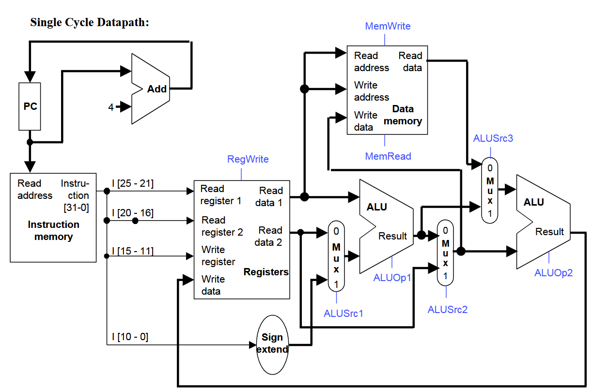
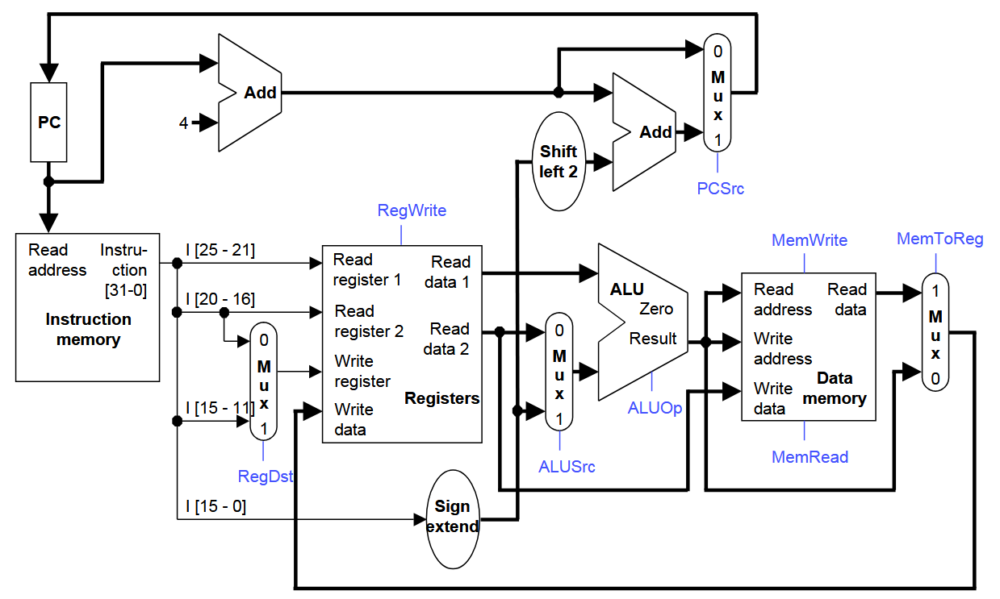
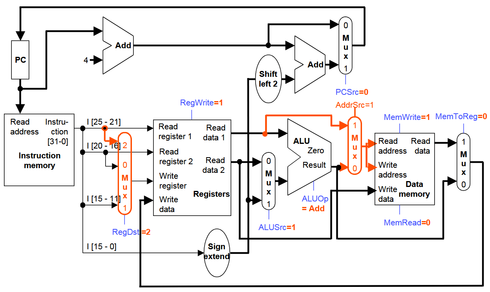

# CSE301 – Computer Organization 
## Tutorial 4  

---

# Single-Cycle CPU Implementation 


**Question 1** On the next page is a **single-cycle datapath** for a machine different from the one seen in lecture.  
It supports the following (complex) instructions:

```asm
lw_add   rd, (rs), rt      # rd = Memory[R[rs]] + R[rt]
addi_st  (rs), rs, imm     # Memory[R[rs]] = R[rs] + imm
sll_add  rd, rs, rt, imm   # rd = (R[rs] << imm) + R[rt]
```

All instructions use the same format (shown below), but not all fields are used by every instruction.


---

### Part (a) – Control Signals

For each of the above instructions, specify how the **control signals** should be set for correct operation.
Use **X** for *don’t care*.
`ALUOp` can be one of: `ADD`, `SUB`, `SLL`, `PASS_A`, or `PASS_B`
(*e.g.,* `PASS_A` means pass through the top operand unchanged).

<table class="tutorial-table">
  <tr>
    <th>inst</th>
    <th>ALUsrc1</th>
    <th>ALUsrc2</th>
    <th>ALUsrc3</th>
    <th>ALUop1</th>
    <th>ALUop2</th>
    <th>MemRead</th>
    <th>MemWrite</th>
    <th>RegWrite</th>
  </tr>
  <tr>
    <td>lw_add</td>
    <td></td><td></td><td></td><td></td><td></td><td></td><td></td><td></td>
  </tr>
  <tr>
    <td>addi_st</td>
    <td></td><td></td><td></td><td></td><td></td><td></td><td></td><td></td>
  </tr>
  <tr>
    <td>sll_add</td>
    <td></td><td></td><td></td><td></td><td></td><td></td><td></td><td></td>
  </tr>
</table>

---

### Part (b) – Functional Unit Latency

Given the following **functional unit latencies**, compute the **minimum time** to perform each instruction type.
Explain your reasoning.

| Functional Unit | Latency |
| --------------- | ------- |
| Register File   | 2 ns    |
| ALU             | 4 ns    |
| Memory          | 3 ns    |

<table class="tutorial-table">
  <tr>
    <th>inst</th>
    <th>Minimum time</th>
    <th>Explain</th>
  </tr>
  <tr>
    <td>lw_add</td>
    <td></td>
    <td></td>
  </tr>
  <tr>
    <td>addi_st</td>
    <td></td>
    <td></td>
  </tr>
  <tr>
    <td>sll_add</td>
    <td></td>
    <td></td>
  </tr>
</table>

---

### Part (c) – CPI and Cycle Time

What are the **CPI** and **cycle time** for this processor?




<p class="page-break">

**Question2** For this question, we will implement a hypothetical instruction **sw+** in the single-cycle pipeline. **sw+** is a “store word, with post increment” that is found in some real architectures (e.g., IA-64). It is encoded as an I-type instruction and performs the following operations:


### Part (a) 

The single-cycle datapath from lecture appears below. Show what changes are needed to support sw+ instruction. You should only add wires and muxes to the datapath; do not modify the main functional units themselves (the memory, register file and ALU). Try to keep your diagram neat!

---

### Part (b) 
On the diagram below, write (next to the signal’s name) values of all control signals required for the sw+ instruction.



<p class="page-break">

## Part 2: Questions with Answers  

**Question1**

### Part (a) – Control Signals

<table class="tutorial-table">
  <tr>
    <th>inst</th>
    <th>ALUsrc1</th>
    <th>ALUsrc2</th>
    <th>ALUsrc3</th>
    <th>ALUop1</th>
    <th>ALUop2</th>
    <th>MemRead</th>
    <th>MemWrite</th>
    <th>RegWrite</th>
  </tr>
  <tr>
    <td>lw_add</td>
    <td>X</td>
    <td>1</td>
    <td>0</td>
    <td>X</td>
    <td>ADD</td>
    <td>1</td>
    <td>0</td>
    <td>1</td>
  </tr>
  <tr>
    <td>addi_st</td>
    <td>1</td>
    <td>0</td>
    <td>X</td>
    <td>ADD</td>
    <td>X</td>
    <td>0</td>
    <td>1</td>
    <td>0</td>
  </tr>
  <tr>
    <td>sll_add</td>
    <td>1</td>
    <td>1</td>
    <td>1</td>
    <td>SLL</td>
    <td>ADD</td>
    <td>0/X</td>
    <td>0</td>
    <td>1</td>
  </tr>
</table>


---

### Part (b) – Functional Unit Latency

<table class="tutorial-table">
  <tr>
    <th>inst</th>
    <th>Minimum time</th>
    <th>Explain</th>
  </tr>
  <tr>
    <td>lw_add</td>
    <td>14 ns</td>
    <td>IMEM (3 ns) + RF_read (2 ns) + DMEM (3 ns) + ALU (4 ns) + RF_write (2 ns)</td>
  </tr>
  <tr>
    <td>addi_st</td>
    <td>12 ns</td>
    <td>IMEM (3 ns) + RF_read (2 ns) + ALU (4 ns) + DMEM (3 ns)</td>
  </tr>
  <tr>
    <td>sll_add</td>
    <td>15 ns</td>
    <td>IMEM (3 ns) + RF_read (2 ns) + ALU (4 ns) + ALU (4 ns) + RF_write (2 ns)</td>
  </tr>
</table>

---

### Part (c) – CPI and Cycle Time

Since the processor is a single-cycle implementation, the CPI is 1. The cycle time is set by the slowest instruction, which in this case is the sll_add, yielding a clock period of 15ns.

<p class="page-break">

**Question2**

